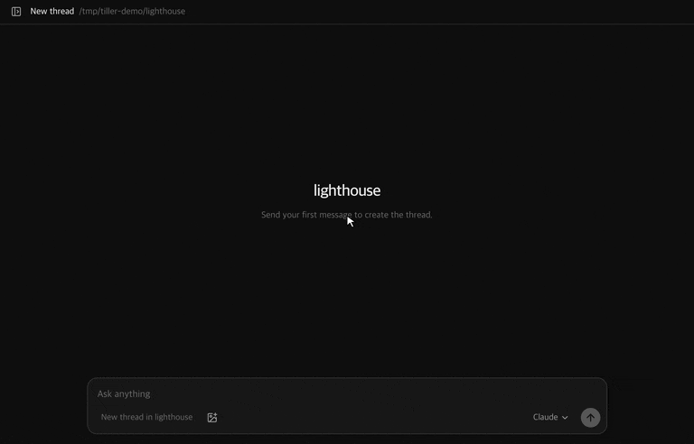

  
  <h1>tiller</h1>
  
<strong>A desktop app for Claude Code and Codex, built around one idea: keep typing while the agent works.</strong>

  

    <a href="https://github.com/miroqaan/tiller/releases">Releases</a> ·
    <a href="https://github.com/miroqaan/tiller/issues/new/choose">Report a bug</a> ·
    <a href="https://github.com/miroqaan/tiller/issues">Issues</a>
  

---

Messages you send mid-turn land in a **visible queue** you can edit, reorder and merge before they go out. **Tab** sends one straight into the turn that is running, which keeps the work it has already done.

## Why

The Claude Code CLI and the official desktop app do one of two things with a message sent while the agent is busy: drop it into an invisible queue, or interrupt on the spot. There is no way to see what is queued, fix it, reorder it, or pick one item to send first.

The same request keeps coming back in the Claude Code issue tracker:

- [anthropics/claude-code#92988](https://github.com/anthropics/claude-code/issues/92988) — the desktop Code tab has no "queue until the turn ends"
- [anthropics/claude-code#77537](https://github.com/anthropics/claude-code/issues/77537) — a first-class queue UI: view, delete and inject items individually
- [anthropics/claude-code#30492](https://github.com/anthropics/claude-code/issues/30492) — real-time steering between tool calls

tiller is a frontend that fills that gap. It does not replace the agent; it drives the one you already have.

## Queue and steer

| Key | Idle | Agent working |
|---|---|---|
| Enter | Send | **Add to queue** |
| Tab | Send | **Send into the running turn (steer)** |
| Shift+Enter | Newline | Newline |
| Esc (empty input) | — | Interrupt the current turn |
| Ctrl+F | Search conversations | Search conversations |

Queued messages sit right above the composer. Until the moment one is sent you can:

- **Edit** it, so you can rewrite a follow-up after seeing how the previous turn went
- **Reorder** by drag, or jump an item to the top
- **Merge** it into the item above; keep pressing to fold several messages into one
- **Send now**, delete one, or clear all

Close the app and the queue is still there when you come back.

## What else is in it

**Two engines, one window.** New conversations start on Claude until you pick another engine; after that they start on the engine you picked last, including by switching a thread's engine. The model, effort and permission mode you picked last carry over to new threads too (model and effort per engine). Both engines get the same queue, steering, approvals, model and effort pickers, plan usage and notifications. A thread can be **carried to the other engine mid-conversation** and continue there.

**Threads that stay organised.** Projects keep your own conversation groups and can be reordered by dragging their headers; conversations outside a project are listed as unfiled. The flag in the sidebar header switches to Priority, where AI judges importance, urgency, dependencies, and your stated priorities from titles and recent conversation excerpts. It shows the last seven days: one combined priority group, then Today and each weekday in the same order. AI tidy-up groups by topic using only titles and folder names. Priority refreshes after you send a message while it is on screen, retries on its own after a failed assessment, and can be reassessed by hand; new threads can be started straight from it. Drag the sidebar edge to resize it; its width is remembered.

**Conversations that read cleanly.** A toggle in the sidebar footer shows or hides tool steps (commands, file reads, edits) and thought summaries; answers stay visible. While a turn runs with work hidden, a single "working…" line stands in until the answer streams. Under each finished turn you see how long it worked and when it finished. Hover over a message you sent to run it again (queued if a turn is running). Background task notices from the engine show as one-line notices, not as messages you typed.

**Open the folders behind a thread.** Right-click a conversation to open its history folder or its working folder in the system file manager.

**Permissions you can see.** Approval requests arrive as an inline card — allow once, always allow, deny — with a per-thread permission mode (default, accept edits, plan, bypass).

**Local videos.** Local video links such as `[title](clip.mp4)` or `` play inside the conversation and reader pane, with playback, seeking, volume and fullscreen controls. Absolute and relative paths work; wrap paths with spaces in `<...>`. MP4/M4V, WebM, MOV and OGV are recognized; codec support depends on the platform. Videos stream from disk without autoplay.

**Remove project groups without losing conversations.** Use a project’s … menu or right-click menu to delete the group after confirmation; its conversations return to the unfiled list and files are left untouched. Deleting a thread removes it from its engine as well, Codex threads included, and it stays deleted.

**Separate drafts for each conversation.** Switching threads restores that thread’s unsent text and image attachments during the current app session.

**Images and diagrams.** Paste or drop images into the composer; they travel with a queued or steered message. Answers render `mermaid` diagrams, `svg` blocks and local image files, and in Codex threads you can ask for a picture and get one. Images and videos in one message share an enlarged viewer: arrow keys move between them, Esc closes it.

**Search that reaches closed threads.** Ctrl+F finds threads by title and by what was said in them, including Codex threads that are not open.

**Find within a document.** Hover, focus, or select text in the reader and press Ctrl+F. Selected text fills the query; matches are highlighted, Enter / Shift+Enter moves between them, and Esc closes search. Outside the reader, Ctrl+F still searches conversations.

**Recover from empty tool errors.** Engine handoff supplies text for empty Claude tool failures. Existing malformed results are backed up and repaired before a thread resumes. Codex also repairs missing history indexes after account changes while preserving fork ancestry.

**Your conversations, kept by tiller.** Every thread is copied into a local vault on your own disk, so a thread opens instantly and survives the engines tidying up their own files. A Claude transcript that Claude Code deleted is put back before the thread is resumed, and if Claude Code no longer knows the session, the conversation tiller holds is written out as a fresh transcript and the thread carries on. See [docs/vault.md](docs/vault.md).

**Multiple accounts per engine.** The sidebar **Accounts** menu lets you add Codex and Claude accounts with **Add account**, without a fixed account-count limit. Existing accounts are preserved and added profiles persist across restarts. Complete the official provider login and select an account between tasks; existing Tiller conversations stay available. The menu shows login status, account email, and per-account plan usage reported by the official engine, including usage percentages and reset times. Usage checks do not send model prompts, and a failed check is displayed separately from login status.

**Everything is local.** Authentication uses your own accounts or API keys. Official engine processes handle browser login and credential storage in separate local profiles; authentication caches are excluded from Tiller's conversation vault. Tiller sends your conversations to the engine you chose.

**English and Korean UI**, following the system language.

## Status

tiller is in development and **no installer has been published yet**. This repository is where releases will appear — [watch it](https://github.com/miroqaan/tiller/subscription) to hear about the first one.

| Platform | State |
|---|---|
| Windows | The development platform. Verified from the unpacked package; installer not yet published |
| macOS | Not built or notarized yet |
| Linux | AppImage planned |

Installers will carry both engines, so the app works straight after installation with nothing else to install. The Claude Code binary ships exactly as Anthropic publishes it: not modified, not re-signed, no sign-in method removed.

## Issues and requests

**This repository is the place for them.** Bug reports, feature requests and questions all go to [Issues](https://github.com/miroqaan/tiller/issues/new/choose) — the templates ask for the few things that make a report actionable (what you did, which engine, which version).

The application source is not here. tiller is proprietary and its source lives in a private repository, so this repository holds the release downloads, the issue tracker, and the published documentation. Pull requests are welcome for the documentation in `docs/`.

Before opening an issue, a quick look through [existing issues](https://github.com/miroqaan/tiller/issues?q=is%3Aissue) saves everyone a round trip. Something that looks like a security problem goes through [SECURITY.md](SECURITY.md) instead, not a public issue.

## Notes

- "Bypass permissions" mode runs everything without asking, including files outside the project. Turn it on only when you mean it.
- The optional computer-use tools move the real mouse and type on the real keyboard of the machine tiller runs on. Expect the cursor to be taken over while a turn runs.

## Legal

tiller is a personal project and is **not affiliated with, endorsed by or sponsored by Anthropic or OpenAI**. Claude and Claude Code are trademarks of Anthropic; Codex is a trademark of OpenAI. Using tiller with either engine is subject to that engine's own terms.

The application is proprietary. See [LICENSE](LICENSE) for what this repository covers.

[한국어 README](README.ko.md)
