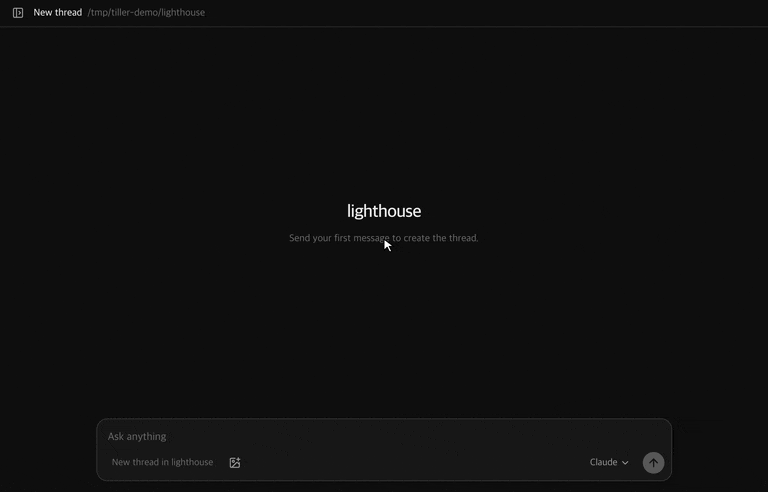

  
  <h1>Tiller</h1>
  
<strong>A desktop app for Claude Code and Codex, built around one idea: keep typing while the agent works.</strong>

  

    <a href="https://github.com/miroqaan/tiller/releases">Releases</a> ·
    <a href="https://github.com/miroqaan/tiller/issues/new/choose">Report a bug</a> ·
    <a href="https://github.com/miroqaan/tiller/issues">Issues</a>
  

---

Messages you send mid-turn land in a **visible queue** you can edit, reorder and merge before they go out. **Tab** sends one straight into the turn that is running, which keeps the work it has already done.

## Why

The Claude Code CLI and the official desktop app do one of two things with a message sent while the agent is busy: drop it into an invisible queue, or interrupt on the spot. There is no way to see what is queued, fix it, reorder it, or pick one item to send first.

The same request keeps coming back in the Claude Code issue tracker:

- [anthropics/claude-code#92988](https://github.com/anthropics/claude-code/issues/92988) — the desktop Code tab has no "queue until the turn ends"
- [anthropics/claude-code#77537](https://github.com/anthropics/claude-code/issues/77537) — a first-class queue UI: view, delete and inject items individually
- [anthropics/claude-code#30492](https://github.com/anthropics/claude-code/issues/30492) — real-time steering between tool calls

Tiller is a frontend that fills that gap. It does not replace the agent; it drives the one you already have.

## Queue and steer

| Key | Idle | Agent working |
|---|---|---|
| Enter | Send | **Add to queue** |
| Tab | Send | **Send into the running turn (steer)** |
| Shift+Enter | Newline | Newline |
| Esc (empty input) | — | Interrupt the current turn |
| Ctrl+F | Search conversations | Search conversations |

Queued messages sit right above the composer. Until the moment one is sent you can:

- **Edit** it, so you can rewrite a follow-up after seeing how the previous turn went
- **Reorder** by drag, or jump an item to the top
- **Merge** it into the item above; keep pressing to fold several messages into one
- **Send now**, delete one, or clear all

Close the app and the queue is still there when you come back.

## What else is in it

**Two engines, one window.** New conversations start on Claude until you pick another engine; after that they start on the engine you picked last, including by switching a thread's engine. The model, effort and permission mode you picked last carry over to new threads too (model and effort per engine). Both engines get the same queue, steering, approvals, model and effort pickers, plan usage and notifications. A thread can be **carried to the other engine mid-conversation** and continue there.

**Threads that stay organised.** Projects keep your own conversation groups and can be reordered by dragging their headers; conversations outside a project are listed as unfiled. The flag in the sidebar header switches to Priority, where AI judges importance, urgency, dependencies, and your stated priorities from titles and recent conversation excerpts. It shows the last seven days: one combined priority group, then Today and each weekday in the same order. AI tidy-up groups by topic using only titles and folder names. Priority refreshes after you send a message while it is on screen, retries on its own after a failed assessment, and can be reassessed by hand; new threads can be started straight from it. Drag the sidebar edge to resize it; its width is remembered.

**Conversations that read cleanly.** A toggle in the sidebar footer shows or hides tool steps (commands, file reads, edits) and thought summaries; answers stay visible. While a turn runs with work hidden, a single "working…" line stands in until the answer streams. Under each finished turn you see how long it worked and when it finished. When a turn ends with commands or subagents the agent put in the background still running, the conversation lists them and shows **Working in background** until the agent picks up again on its own, which shows as working too. An ordinary command that was moved to the background only because it ran long is not counted. Hover over a message you sent to run it again (queued if a turn is running). Background task notices from the engine show as one-line notices, not as messages you typed.

**Orchestration.** Turn on orchestration for a thread with the network button in its composer, and its agent can hand work to other conversations: a fresh conversation with its own brief, a copy of this one (it lives inside the conversation: not listed, not saved as a conversation, and gone once its result, kept in the conversation with what it was asked, is in), or an existing thread, which gets the message once it is idle. Every answer comes back into the orchestrating thread on its own, as a "Delegated task result" card with what was asked above it. Tasks start as fast as the computer allows: Tiller watches processor load and free memory and holds the rest until there is room, and every orchestrator keeps at least one task running. The processor limit and the maximum at once (automatic by default) are in app settings. Choose **No limit** for the CPU limit to stop waiting on processor load; memory and concurrency limits still apply. The orchestrator can also set the model and effort of the threads it hands work to. Orchestrating threads have their own section at the top of the sidebar, with a count of running and handed-out work, and a mark in the thread header and tab; their work is listed under them with each task's state, and an existing thread shows there while it works for one.

**Reference studies and improvement loops.** Use `/reference <topic>` in an existing conversation to start a reference study. Documents appear in the sidebar when they are written, including the first study without switching conversations. Projects with a `.tiller/loop.json` definition can run measured improvement rounds with safety tests, candidate comparisons, and user verdicts. App settings also offers an optional CPU and memory usage display, off by default.

**Open the folders behind a thread.** Right-click a conversation to open its history folder or its working folder in the system file manager.

**Permissions you can see.** Approval requests arrive as an inline card — allow once, always allow, deny — with a per-thread permission mode (default, accept edits, plan, bypass). Only a fresh conversation created by an orchestrator inherits its permission mode. Existing conversations keep their own mode when assigned or linked to a task; copies keep the source conversation’s mode.

**Side chat.** Ask something aside without it going into the thread: the dashed speech-bubble button in a thread's header (or ⌘J / Ctrl+J) opens a side chat that knows the thread's conversation so far. It is never saved: not in the thread list, search or vault, and neither engine keeps its transcript. It can read files but not change them, and it is gone when you close it or switch threads.

**Local videos.** Local video links such as `[title](clip.mp4)` or `` play inside the conversation and reader pane, with playback, seeking, volume and fullscreen controls. Absolute and relative paths work; wrap paths with spaces in `<...>`. MP4/M4V, WebM, MOV and OGV are recognized; codec support depends on the platform. Videos stream from disk without autoplay.

**Remove project groups without losing conversations.** Use a project’s … menu or right-click menu to delete the group after confirmation; its conversations return to the unfiled list and files are left untouched. Deleting a thread removes it from its engine as well, Codex threads included, and it stays deleted.

**Separate drafts for each conversation.** Switching threads restores that thread’s unsent text and image attachments during the current app session.

**Images and diagrams.** Paste or drop images into the composer; they travel with a queued or steered message. Answers render `mermaid` diagrams, `svg` blocks and local image files, and in Codex threads you can ask for a picture and get one. Images and videos in one message share an enlarged viewer: arrow keys move between them, Esc closes it. Right-click any picture to copy it, or its file path.

**File links.** Office documents, PDFs and Aseprite originals (`.aseprite`, `.ase`) open in the operating system's associated app. PNG previews stay visible in the conversation; text files open in the reader. Local paths support spaces and Unicode names.

**Search that reaches every thread.** Ctrl+F finds threads by title and by what was said in them: open or closed, Claude or Codex, from this device or another. Every word of the query must appear, in any order; spacing, case and full/half width do not matter, so Korean and Japanese match inside words, and commit hashes, paths and URLs match as written. A result opens the thread at that message; "Mine only" and a period narrow the list.

**Find within a document.** Hover, focus, or select text in the reader and press Ctrl+F. Selected text fills the query; matches are highlighted, Enter / Shift+Enter moves between them, and Esc closes search. Outside the reader, Ctrl+F still searches conversations.

**Recover from empty tool errors.** Engine handoff supplies text for empty Claude tool failures. Existing malformed results are backed up and repaired before a thread resumes. Codex also repairs missing history indexes after account changes while preserving fork ancestry.

**Your conversations, kept by Tiller.** Conversations, engine history copies and attachments live in ordinary project folders under your local vault, normally `Documents/Tiller`. Click the **current vault name in the sidebar** to create a vault in a new folder, open an existing folder, rename its display name on this device, or open another vault in a window of its own. The manager can show a vault in your file manager or remove a vault without an open window from the list while preserving all its files; the default vault stays registered. Local vaults need no account. Separate sync settings provide working-folder mappings, Claude CLI discovery and optional encrypted synchronization in the development preview. Claude conversations can be prepared for terminal resume; Codex conversations received from another device can continue locally. See [the vault guide](docs/vault.md) and [sync preview](docs/sync.md).

**Engine accounts of Tiller's own.** Tiller runs Claude and Codex only on accounts it keeps for itself, each signed in with the official provider login inside Tiller. It does not use the terminal's `~/.claude` or `~/.codex` login, settings or history. The sidebar **Accounts** menu adds accounts without a fixed limit and shows each one's login status, email and plan usage reported by the official engine; usage checks send no model prompts. **Log out** signs an account out with the engine's own logout and keeps it listed; deleting an account removes its login and settings but keeps its conversations. When the account in use goes, the engine moves to another signed-in account. **Switch account or AI at the usage limit** in the app settings (off by default) carries a conversation that hit the usage limit on with another signed-in account of the engine, or with the other AI when none has usage left. An engine without an account shows **Sign in to Claude** or **Sign in to Codex** in the composer and on its conversations, which stay readable until then. Skills, agents, commands, rules and plugins are copied from the terminal once, and **Import from terminal** brings in what was added there later without replacing Tiller's. The first start of this version moves Tiller's conversations to Tiller's own engine history and only reads the terminal's files. When Claude does not apply a folder's allow rules because the folder is not trusted, the conversation says so with **Trust this folder**.

**Tiller Sync inside the app.** Sign in with GitHub from the sync panel, check your sync access and its expiry, then create an encrypted remote vault or connect an existing one. The test service is selected automatically; there is no server address to enter in the normal flow. GitHub authorization opens in your browser, and setup continues in Tiller. Test access is assigned to selected accounts; signing in does not automatically grant it. Paid subscriptions are not on sale yet.

**Keep working during sync.** Sync goes file by file: only changed files, and only the changed pieces of large ones, are transferred, and a file that fails is retried without holding up the rest. A compact status button shows what is left to upload and download, a pause control and a sync log named by conversation. A conversation answering on one device uploads at most once a minute and shows as running on the others.

**Choose working files to sync.** The current vault's **Work file sync** lets you select files or folders, including `.env` and project key files, with individual child exclusions. Cache and temporary files stay excluded. Generated image originals travel with conversations. Video cards offer **Include in sync**; other devices download video/audio originals when needed or keep them offline. Excluding a file preserves local originals. See [selection, recovery and size limits](docs/sync.md#choose-working-files).

**Instructions managed from the vault.** Open the current vault’s **Agent instructions** to edit common rules for Claude and Codex. These rules sync with a connected vault. **Additional instructions** shows existing global and project instruction files for the selected engine account and working folder; edit them in place with their source paths visible. Project files sync only if selected in **Work file sync**. Changes take effect in new conversations or after closing and reopening a conversation. External edits and sync conflicts preserve a copy for review. See [the instructions guide](docs/vault.md#agent-instructions).

**Local storage by default.** No sync account is needed to keep, read or search local conversations. Official engine processes handle provider login and credential storage in separate local profiles, and Tiller sends your conversations to the engine you choose. Connecting a vault explicitly enables uploads of an end-to-end encrypted copy; engine credentials, sync tokens, queued actions and permission settings are excluded. A staging cloud service is deployed for testing.

**Create or import a vault by name.** New vaults get their own folder under `Tiller Vaults` in your home folder, and you can choose another location; existing vault locations stay unchanged. To import a cloud vault, choose it, enter a local name and its encryption password, then open the prepared vault to start downloading. See [the vault guide](docs/vault.md).

**One vault on every device.** A vault that already has conversations can connect to the cloud vault another device uses. Tiller warns first because a merge cannot be undone; both sides are then combined, conversations changed differently on each side are kept as copies, and conversations you deleted on this device are removed from the cloud vault too. Conversations working inside the vault or the home folder continue on each device without setup; other folders are linked in place from the conversation. Codex conversations create a local thread on first import, then append only new conversation content to that thread, including after restarting Tiller. Unchanged syncs add no duplicate import notice. If earlier content changes or local engine history is missing, Tiller rebuilds the local context from the conversation. Projects you create travel with the vault; AI tidy-up groups stay on each device. Cloud vaults have names and can be renamed or deleted. See [one cloud vault for all devices](docs/sync.md#one-cloud-vault-for-all-devices).

**A window for each vault.** As in Obsidian, every vault opens in a window of its own. Opening another vault leaves the current window, its running work and its sync as they are; a vault that already has a window comes to the front. Closing the last window quits Tiller, and the next start opens the same windows again.

**English, Korean and Japanese UI**, following the system language or the one you pick in App settings. The phone app follows the phone's language.

## Status

Tiller 0.2.0 is out as a **Windows x64 pre-release**. Download `Tiller-Setup-0.2.0-x64.exe` from the [Releases page](https://github.com/miroqaan/tiller/releases). The installer is not code-signed yet, so Windows SmartScreen warns about an unknown publisher; you can check the download against `SHA256SUMS.txt` first. There are no automatic updates yet — [watch this repository](https://github.com/miroqaan/tiller/subscription) to hear about new releases. Sync and Tiller sign-in are not in the installer yet (shown as coming soon), so the phone app cannot connect to it.

The vault and sync features documented here are an implemented development preview and **may be ahead of the latest release**. The staging service and GitHub sign-in have been tested; paid billing and real cross-OS or physical-device sync acceptance remain unfinished. Custom service addresses and the encrypted-folder option are advanced settings. The folder option is for local testing on one filesystem; Dropbox-style file replication is unsupported.

| Platform | State |
|---|---|
| Windows | x64 pre-release installer published (0.2.0, not code-signed) |
| macOS | Not built or notarized yet |
| Linux | AppImage planned |

The installer carries both engines, so the app works straight after installation with nothing else to install. The Claude Code binary ships exactly as Anthropic publishes it: not modified, not re-signed, no sign-in method removed.

## Issues and requests

**This repository is the place for them.** Bug reports, feature requests and questions all go to [Issues](https://github.com/miroqaan/tiller/issues/new/choose) — the templates ask for the few things that make a report actionable (what you did, which engine, which version).

The application source is not here. Tiller is proprietary and its source lives in a private repository, so this repository holds the release downloads, the issue tracker, and the published documentation. Pull requests are welcome for the documentation in `docs/`.

Before opening an issue, a quick look through [existing issues](https://github.com/miroqaan/tiller/issues?q=is%3Aissue) saves everyone a round trip. Something that looks like a security problem goes through [SECURITY.md](SECURITY.md) instead, not a public issue.

## Notes

- "Bypass permissions" mode runs everything without asking, including files outside the project. Turn it on only when you mean it.
- The optional computer-use tools move the real mouse and type on the real keyboard of the machine Tiller runs on. Expect the cursor to be taken over while a turn runs.

## Legal

Tiller is a personal project and is **not affiliated with, endorsed by or sponsored by Anthropic or OpenAI**. Claude and Claude Code are trademarks of Anthropic; Codex is a trademark of OpenAI. Using Tiller with either engine is subject to that engine's own terms.

The application is proprietary. See [LICENSE](LICENSE) for what this repository covers.
